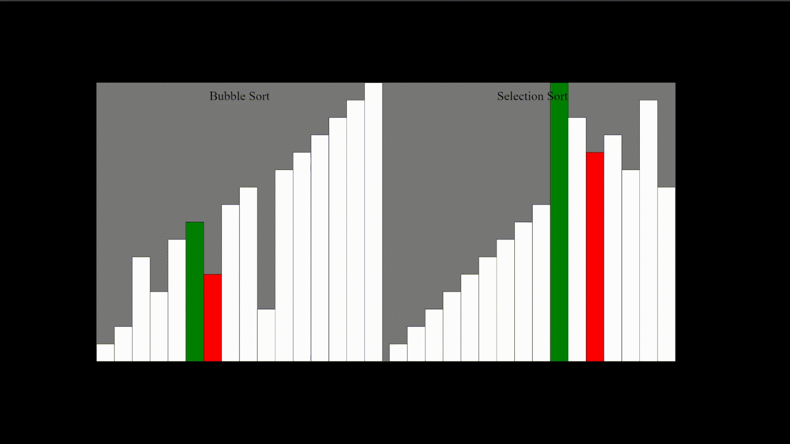

# Sorting Algorithms: Bubble Sort and Selection Sort

This repository provides implementations of two popular sorting algorithms: Bubble Sort and Selection Sort.

## Bubble Sort

Bubble Sort is a simple comparison-based sorting algorithm. It repeatedly steps through the list, compares adjacent elements, and swaps them if they are in the wrong order. The pass through the list is repeated until the list is sorted.

### Algorithm Steps:

1. Start from the first element and compare it with the next element.
2. If the next element is smaller, swap them.
3. Repeat this process for each pair of adjacent elements until the end of the list.
4. Repeat steps 1-3 for the remaining unsorted portion of the list until the entire list is sorted.

## Selection Sort

Selection Sort is another simple comparison-based sorting algorithm. It divides the input list into two parts: the sorted part at the left end and the unsorted part at the right end. It repeatedly selects the smallest element from the unsorted part and swaps it with the leftmost element of the unsorted part.

### Algorithm Steps:

1. Find the minimum element in the unsorted part of the list.
2. Swap the minimum element with the leftmost element of the unsorted part.
3. Move the boundary of the sorted part one element to the right.
4. Repeat steps 1-3 until the entire list is sorted.

## Showcase

